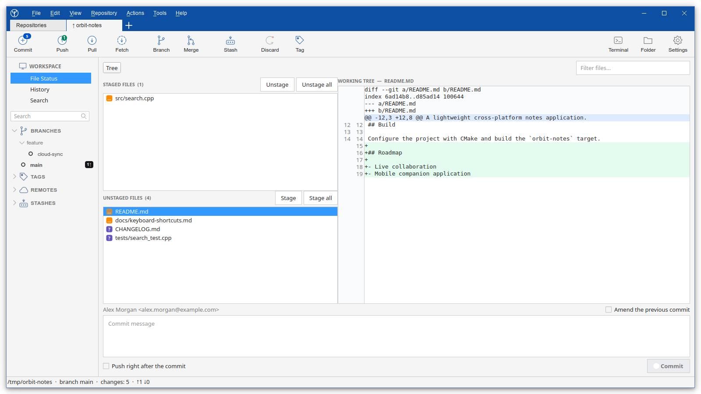
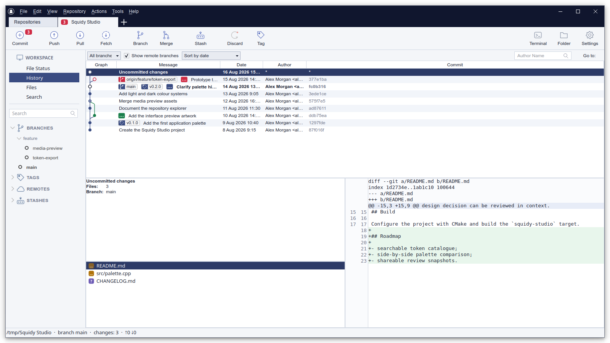
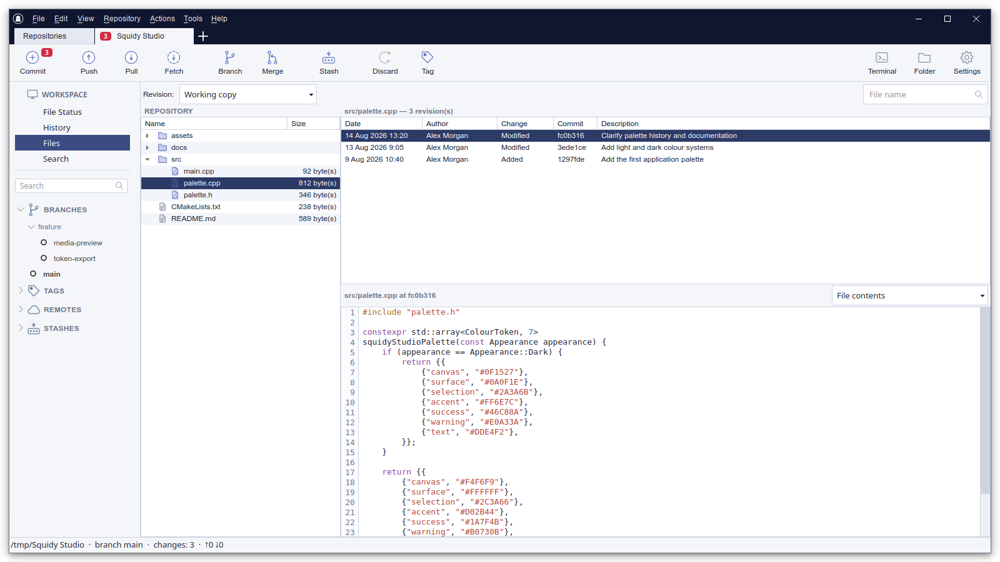
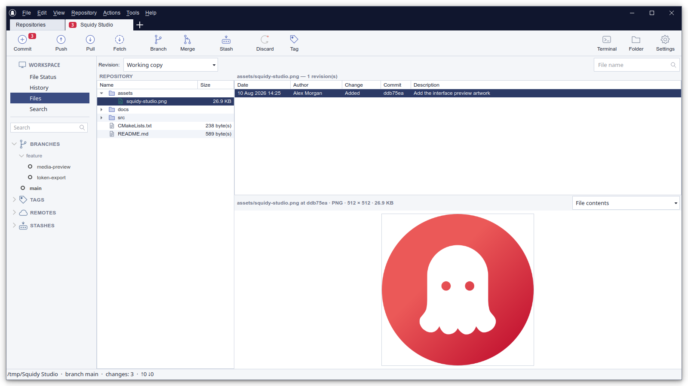
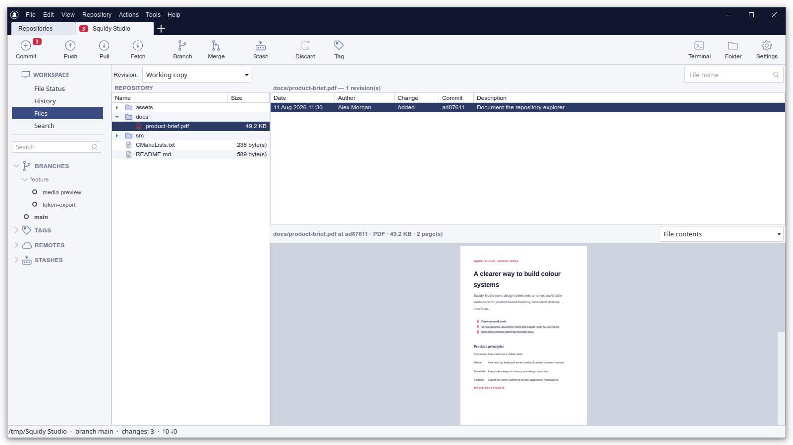
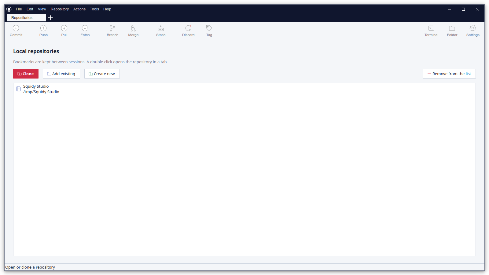

<!-- Copyright (c) 2026 Sergey Yakunin <sergey@squidy.ru> -->

# SquidyGit

<p align="center">
  
</p>

<p align="center">
  A fast native desktop Git client for Linux and Windows, with experimental macOS
  packages, built with C++20 and Qt 6.
</p>

<p align="center">
  
</p>

<p align="center">
  <a href="README.md">English</a> · <a href="README.ru.md">Русский</a> · <a href="README.zh-CN.md">简体中文</a>
</p>

## Why SquidyGit exists

I wanted the kind of desktop client that keeps history, staging and branches in one
window, and on Linux I could not find one that fit. Some tools were too limited, some
were too heavy for what they did, and the polished ones were either commercial or simply
never released for Linux.

So I started writing the client I wanted to use every day: a familiar layout, native
code, no account to create, no telemetry, and an MIT licence.

SquidyGit keeps the common Git operations visible instead of wrapping them in its own
vocabulary. It drives the `git` executable already installed on your system. Operations
inside an open repository appear in the built-in session log with their result; cloning
shows its command and live output in the clone dialog.

## What makes it different

- The repository command log shows the Git command and whether it succeeded, with a
  short output excerpt for failures; cloning has its own live progress log
- SquidyGit calls the system `git` binary and carries no embedded Git implementation, so
  behaviour matches your own configuration and hooks
- C++20 and Qt 6, without Electron, a bundled runtime or a background service
- MIT licence, no sign-in, no telemetry, no feature gates and no licence reminders
- English, Russian and Simplified Chinese cover the whole interface, not just a handful
  of menus

## Screenshots

The screenshots below show the current English interface using the light theme.

### Repository workspace

Branches, tags, staged and unstaged files, a live diff and commit controls stay visible
in one compact, resizable workspace.

<p align="center">
  
</p>

### Commit history

The history view combines a visual graph, branch and tag labels, filters, changed files,
commit details and a diff preview.

<p align="center">
  
</p>

### Repository files and file history

Browse the tracked tree at the working copy, branch, tag or commit. The selected file's
timeline and syntax-highlighted historical contents remain visible together.

<p align="center">
  
</p>

### Images and PDF documents

The same read-only workspace previews tracked images and multi-page PDF documents
without extracting them or checking out another revision.

<p align="center">
  
  
</p>

### Repository list

Open an existing repository, clone a remote project or initialize a new one.

<p align="center">
  
</p>

## What works today

### Working tree and commits

- Separate lists of staged and unstaged files, with flat and directory-tree views,
  filtering and status badges
- Unified diff viewer with old and new line numbers and colour highlighting
- A full side-by-side diff window, opened from the diff context menu
- Staging, unstaging and discarding by hunk or by individual line
- Commit, amend and an optional push right after the commit

### History

- Visual commit graph with branches, tags, merge commits and commit details
- Changed files and a diff preview for the selected commit
- Search by message, author, file contents, path or SHA

### Files and file history

- Browse tracked files in the working copy, HEAD, any branch, tag or commit without
  checking it out
- Follow a file across renames, reach deleted files through older revisions and jump
  from the file timeline to the full commit
- View the changes made by a commit, read historical contents or compare a historical
  version with the revision selected in the tree
- Filter by file name and preview source code with line numbers and syntax highlighting,
  images and SVG drawings, PDFs when Qt PDF is available, and binary data as a hex dump

### Branches and remotes

- Create, check out, rename, delete, merge and rebase branches
- Fetch, pull and push with upstream tracking, tags and `--force-with-lease`
- Cherry-pick, revert and reset, with confirmation for destructive operations
- Stashes, tags, remotes and a submodule list

### Application

- Repository tabs, bookmarks and automatic session restoration
- Background remote checks keep incoming commit counters current without pressing
  Fetch
- External Git metadata and index changes trigger a debounced refresh; ordinary
  working-tree edits are discovered on the next refresh
- Light and dark themes
- English, Russian and Simplified Chinese, with a manual language selector
- Per-repository author name and e-mail settings
- Quick access to a terminal and to the repository folder
- Automatic and manual update checks with SHA-256 verification before a release package
  is opened or installed
- Built-in session log for repository Git commands, including result status and a short
  failure summary; clone progress and output remain visible in the clone dialog

## What is planned

The list below is roughly in the order I intend to work on it. It is a statement of
intent, not a schedule.

### Next

- Credential handling: a built-in prompt for HTTPS passwords and SSH key passphrases,
  so private repositories work without preparing a credential helper first
- Complete automatic refresh for ordinary working-tree edits and harden refresh for
  large repositories
- External diff and merge tools, including conflict resolution through Meld, KDiff3 and
  similar utilities
- Blame with per-line authorship

### Planned

- Git Flow: initialization and the feature, release and hotfix operations
- Interactive rebase with reordering, squashing and message editing
- Undo for the last operation, based on `git reflog`
- Reusable repository profiles with an identity and key, plus a warning before
  committing as the wrong author
- A persistent Flight Recorder with duration, exit status, complete output, secret
  redaction and shell-safe export to a terminal or CI job
- Submodule operations, `git clean`, creating and applying patches
- Faster history on large repositories through lazy loading
- Custom actions: user-defined commands available from the menus

### Under consideration

- Git LFS support
- Pull request integration with the common hosting services

## Contributing

I write SquidyGit in my own time, and I would be glad if someone joined in. Bug reports
and ideas are useful on their own, and anything from the list above is free to pick up.
Say so in an issue first and it will not be written twice. Patches are welcome regardless
of size; so are translations into other languages and a second pair of eyes on the
interface wording.

If you would rather ask something before starting, write to &lt;sergey@squidy.ru&gt;
or open an issue.

## Interface languages

SquidyGit follows the operating-system language by default. English, Russian and
Simplified Chinese can also be selected manually from **View → Language**; the new
language is applied after the application restarts.

## Technology

SquidyGit is a native C++20 application built with:

- Qt 6.11.1 or newer: Core, Gui, Widgets, Concurrent, Network and SVG;
  PDF/PdfWidgets is optional
- CMake 3.16 or newer
- The system Git command-line client

Platform-dependent behavior—locating Git, opening terminals and file managers,
restarting the application, and installing updates—is isolated behind
`PlatformServices`. CMake selects the Linux, Windows or macOS implementation, with a
generic fallback for unsupported hosts; the core and UI do not contain OS-specific
branches.

No runtime is bundled, and there is no embedded Git implementation.

## Packages and updates

[GitHub Releases](https://github.com/squidyru/squidy-git/releases) currently publish:

- DEB and AppImage packages for x86-64 Linux
- an installer and a portable ZIP archive for x64 Windows
- experimental DMG packages for Apple silicon and Intel Macs

SquidyGit can check GitHub Releases automatically or on demand. Before opening an
update, it verifies the selected package against a SHA-256 digest published with the
release. macOS packages remain experimental while native integration, signing,
notarization and release testing are being validated.

## Build

### Linux

Install a C++20 compiler, CMake, Git and the Qt 6.11.1 (or newer) development packages, including the
Qt Linguist tools (`qt6-l10n-tools` and `qt6-tools-dev` on Debian and Ubuntu), then run:

```bash
cmake -S . -B build -DCMAKE_BUILD_TYPE=Release
cmake --build build --parallel
./build/SquidyGit
```

The Qt PDF development module is optional (`qt6-pdf-dev` on Debian and Ubuntu). Without
it, SquidyGit still builds and shows PDF revisions as a hexadecimal byte dump.

To install the application, desktop entry and icons for the current user:

```bash
cmake --install build --prefix ~/.local
```

To build a DEB package for Debian or Ubuntu:

```bash
cmake -S . -B build -DCMAKE_BUILD_TYPE=Release
cmake --build build --target deb_package
```

The `deb_package` target always uses a separate Release build, even when the active CLion
profile is configured for Debug. Reload CMake in CLion, select `deb_package` in the CMake
tool window and build the target. The resulting package is written to `build/dist`.

### Windows

Install Qt 6.11.1 or newer with MinGW, then point CMake to your Qt installation:

```powershell
cmake -S . -B build -DCMAKE_PREFIX_PATH=C:/Qt/6.x.x/mingw_64
cmake --build build --parallel
.\build\SquidyGit.exe
```

The Windows build automatically runs `windeployqt` and copies the required Qt runtime
files next to the executable.

To build the Windows installer, install Inno Setup 6.3 or newer and run:

```powershell
cmake --build build --target windows_installer
```

The installer is written to `build/dist/SquidyGit-0.0.2-windows-x64.exe`. It installs
SquidyGit into `Program Files`, creates Start menu and desktop shortcuts, and includes
an uninstaller. Administrator permission is requested during installation. A newer
installer upgrades the existing installation in place, which is what the built-in
update check uses.

To create the portable ZIP archive instead, run:

```powershell
cmake --build build --target windows_portable
```

### macOS (experimental)

Install a C++20 compiler, CMake, Git and Qt 6.11.1 or newer. When Qt was installed with Homebrew, a
local build can be created with:

```bash
cmake -S . -B build -DCMAKE_BUILD_TYPE=Release \
  -DCMAKE_PREFIX_PATH="$(brew --prefix qt)"
cmake --build build --parallel
open build/SquidyGit.app
```

Release CI deploys the required Qt libraries and creates separate DMG packages for
Apple silicon and Intel Macs.

## Safety and current limits

Potentially destructive operations, including discarding changes, hard reset and branch
deletion, require confirmation.

Interactive credential prompts are disabled so that Git can never block the interface
waiting for input. Until the built-in prompt described above is finished, private
repositories therefore need an SSH key or a configured Git credential helper.

Conflicts can currently be resolved by taking one side of the file as a whole; a
three-way view and external merge tools are on the list.

## License

SquidyGit is available under the [MIT License](LICENSE).

Copyright (c) 2026 Sergey Yakunin &lt;sergey@squidy.ru&gt;
