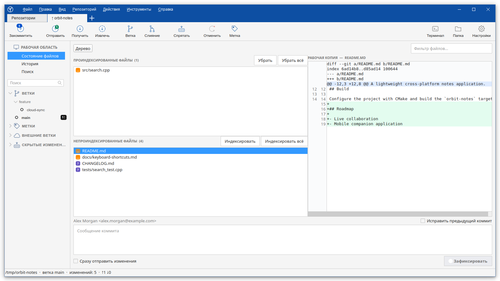
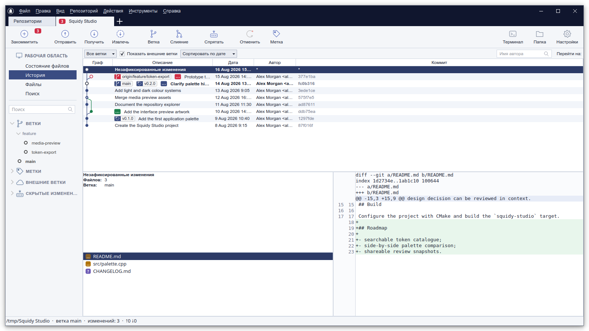
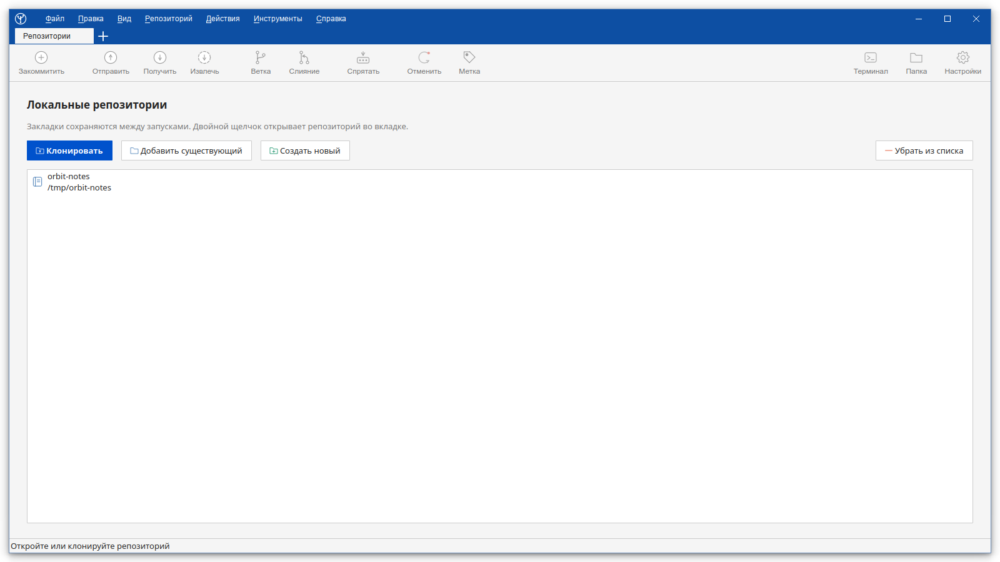

<!-- Copyright (c) 2026 Sergey Yakunin <sergey@squidy.ru> -->

# SquidyGit

<p align="center">
  
</p>

<p align="center">
  Быстрый нативный Git-клиент для Linux и Windows на C++20 и Qt 6.
</p>

<p align="center">
  
</p>

<p align="center">
  <a href="README.md">English</a> · <a href="README.ru.md">Русский</a> · <a href="README.zh-CN.md">简体中文</a>
</p>

## Почему появился SquidyGit

Мне был нужен настольный клиент, в котором история, индексация и ветки живут в одном
окне, и под Linux я такого не нашёл. Одни приложения оказались слишком ограниченными,
другие — тяжёлыми для того, что они делают, а удачные либо платные, либо просто никогда
не выходили под Linux. SourceTree, к раскладке которого я привык на других системах,
существует только для macOS и Windows.

Так что я начал писать клиент, которым хотел пользоваться сам: знакомая компоновка,
нативный код, без регистрации, без телеметрии и под лицензией MIT.

SquidyGit держит основные операции Git на виду и не переизобретает их названия.
Приложение работает через `git`, уже установленный в системе, и записывает каждую
выполненную команду во встроенный журнал — то есть не делает ничего, что нельзя было бы
посмотреть или повторить в терминале самому.

## Чем он отличается

- Каждая команда Git, которую выполняет приложение, видна в журнале вместе с её выводом
- SquidyGit вызывает системный `git` и не содержит собственной реализации Git, поэтому
  поведение совпадает с вашей конфигурацией, хуками и алиасами
- C++20 и Qt 6, без Electron, встроенного рантайма и фоновых служб
- Лицензия MIT, без входа в аккаунт, телеметрии, урезанных функций и напоминаний о покупке
- Английский, русский и упрощённый китайский покрывают весь интерфейс, а не несколько
  пунктов меню

## Скриншоты

Ниже показан актуальный русскоязычный интерфейс со светлой темой.

### Рабочее пространство репозитория

Ветки, теги, проиндексированные и непроиндексированные файлы, diff и элементы создания
коммита остаются на виду в одном компактном рабочем пространстве с изменяемыми панелями.

<p align="center">
  
</p>

### История коммитов

Экран истории объединяет граф, метки веток и тегов, фильтры, изменённые файлы,
сведения о коммите и просмотр diff.

<p align="center">
  
</p>

### Список репозиториев

Можно открыть существующий репозиторий, клонировать удалённый проект или создать новый.

<p align="center">
  
</p>

## Что уже работает

### Рабочая копия и коммиты

- Раздельные списки проиндексированных и непроиндексированных файлов, плоское
  представление и дерево каталогов, фильтр и цветные статусы
- Просмотр unified diff с номерами старых и новых строк и цветовой подсветкой
- Полноценное окно построчного сравнения, доступное из контекстного меню diff
- Индексация, удаление из индекса и откат по отдельным ханкам или строкам
- Коммит, исправление предыдущего коммита и необязательный push сразу после коммита

### История

- Визуальный граф с ветками, тегами, merge-коммитами и подробностями коммита
- Изменённые файлы и предпросмотр diff для выбранного коммита
- Поиск по описанию, автору, содержимому файлов, пути или SHA

### Ветки и удалённые репозитории

- Создание, переключение, переименование, удаление, merge и rebase веток
- Fetch, pull и push с настройкой upstream, отправкой тегов и `--force-with-lease`
- Cherry-pick, revert и reset с подтверждением опасных действий
- Stash, теги, удалённые репозитории и список подмодулей

### Приложение

- Вкладки репозиториев, закладки и автоматическое восстановление сессии
- Фоновая проверка внешних репозиториев: счётчики входящих коммитов актуальны без
  нажатия «Получить изменения»
- Светлая и тёмная темы
- Английский, русский и упрощённый китайский с ручным выбором языка
- Быстрый переход в терминал и в папку репозитория
- Встроенный журнал всех выполненных команд Git

## Что планируется

Список идёт примерно в том порядке, в котором я собираюсь этим заниматься. Это намерения,
а не сроки.

### Ближайшее

- Работа с учётными данными: собственный запрос пароля для HTTPS и парольной фразы для
  SSH-ключа, чтобы приватные репозитории работали без предварительной настройки
  credential helper
- Автоматическое обновление, когда репозиторий меняется вне приложения
- Внешние программы сравнения и слияния, включая разрешение конфликтов через Meld,
  KDiff3 и подобные
- Blame и история отдельного файла

### В планах

- Git Flow: инициализация и операции feature, release и hotfix
- Интерактивный rebase с переупорядочиванием, объединением и правкой сообщений
- Отмена последней операции на основе `git reflog`
- Профили репозитория: имя, почта и ключ для каждого репозитория с предупреждением, если
  коммит уходит не от того автора
- Экспорт журнала команд в готовый shell-скрипт, чтобы последовательность, выполненную в
  интерфейсе, можно было перенести в терминал или в CI
- Операции с подмодулями, `git clean`, создание и применение патчей
- Быстрая история на больших репозиториях за счёт ленивой подгрузки
- Пользовательские команды, доступные из меню

### Рассматривается

- Поддержка Git LFS
- Работа с pull request'ами на распространённых хостингах
- Сборки для macOS

## Участие в разработке

Я пишу SquidyGit в свободное время и буду рад, если кто-то присоединится. Сообщения об
ошибках и идеи полезны сами по себе, а любой пункт из списка выше можно взять — напишите
об этом в issue, чтобы работа не была сделана дважды. Патчи приветствуются независимо от
размера, как и переводы на другие языки и свежий взгляд на формулировки в интерфейсе.

Если удобнее сначала спросить — пишите на &lt;sergey@squidy.ru&gt; или открывайте issue.

## Язык интерфейса

По умолчанию SquidyGit использует язык операционной системы. Английский, русский или
упрощённый китайский также можно выбрать вручную через **Вид → Язык**. Новый язык
применяется после перезапуска приложения.

## Технологии

SquidyGit — нативное приложение на C++20, использующее:

- Qt 6: Core, Gui, Widgets и Concurrent
- CMake 3.16 или новее
- Системный клиент Git

Дополнительная runtime-библиотека или встроенная реализация Git не требуется.

## Сборка

### Linux

Установите компилятор с поддержкой C++20, CMake, Git и пакеты разработки Qt 6,
включая инструменты Qt Linguist (в Debian и Ubuntu — `qt6-l10n-tools` и `qt6-tools-dev`):

```bash
cmake -S . -B build -DCMAKE_BUILD_TYPE=Release
cmake --build build --parallel
./build/SquidyGit
```

Установка приложения, desktop-файла и иконок для текущего пользователя:

```bash
cmake --install build --prefix ~/.local
```

Сборка DEB-пакета для Debian/Ubuntu:

```bash
cmake -S . -B build -DCMAKE_BUILD_TYPE=Release
cmake --build build --target deb_package
```

Цель `deb_package` всегда использует отдельную Release-сборку, даже если
текущий профиль CLion настроен на Debug. В CLion обновите CMake, выберите
`deb_package` в окне CMake и запустите сборку цели. Готовый пакет будет создан в
`build/dist`.

### Windows

Установите Qt 6 с MinGW и передайте CMake путь к Qt:

```powershell
cmake -S . -B build -DCMAKE_PREFIX_PATH=C:/Qt/6.x.x/mingw_64
cmake --build build --parallel
.\build\SquidyGit.exe
```

При сборке на Windows автоматически запускается `windeployqt`, который копирует необходимые
компоненты Qt рядом с исполняемым файлом.

Для сборки Windows-установщика установите Inno Setup 6.3 или новее и выполните:

```powershell
cmake --build build --target windows_installer
```

Готовый файл появится по пути `build/dist/SquidyGit-0.0.1-windows-x64.exe`. Установщик
устанавливает SquidyGit в `Program Files`, создаёт ярлыки на рабочем столе и в меню «Пуск»,
а также добавляет программу удаления. Во время установки Windows запросит права администратора.
Более новый установщик обновляет уже установленную программу на месте — на этом построена
встроенная проверка обновлений.

## Безопасность и текущие ограничения

Потенциально опасные действия — откат изменений, hard reset и удаление веток — требуют
подтверждения.

Интерактивный запрос учётных данных отключён, чтобы Git никогда не мог заблокировать
интерфейс в ожидании ввода. Пока собственный запрос, описанный выше, не готов, для
приватных репозиториев нужен SSH-ключ или настроенный Git credential helper.

Конфликты сейчас разрешаются выбором одной из сторон файла целиком; трёхпанельный вид и
внешние программы слияния — в списке планов.

## Лицензия

SquidyGit распространяется по условиям [лицензии MIT](LICENSE).

Copyright (c) 2026 Sergey Yakunin &lt;sergey@squidy.ru&gt;
