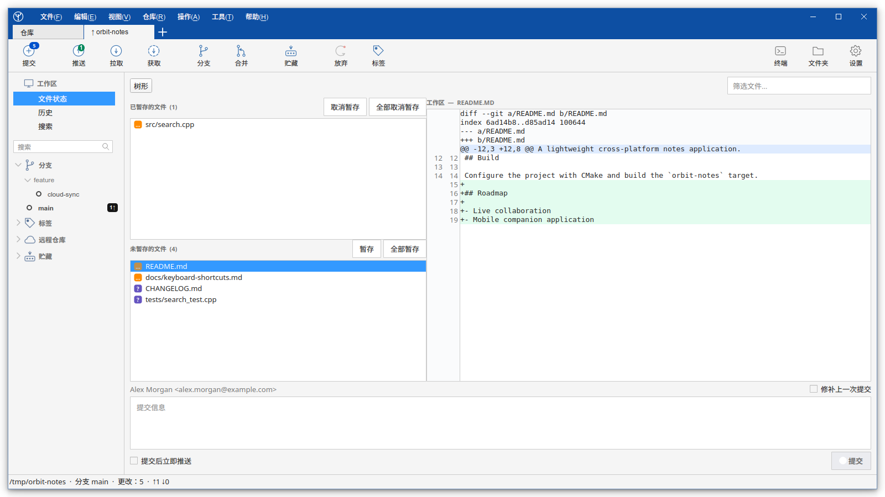
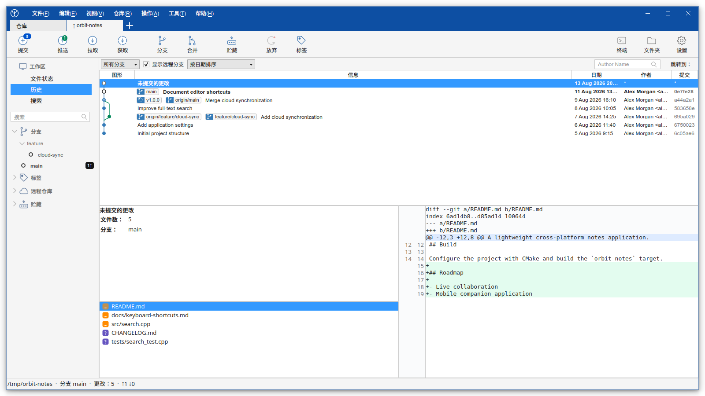
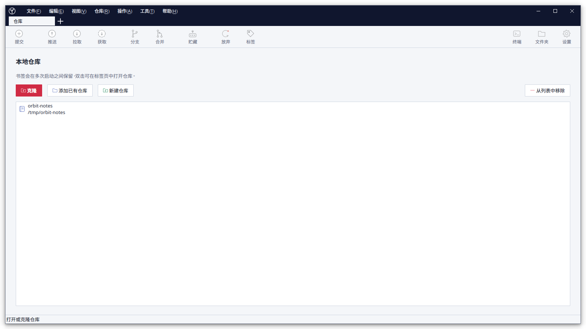

<!-- Copyright (c) 2026 Sergey Yakunin <sergey@squidy.ru> -->

# SquidyGit

<p align="center">
  
</p>

<p align="center">
  一款面向 Linux 和 Windows、使用 C++20 与 Qt 6 构建的快速原生 Git 客户端。
</p>

<p align="center">
  
</p>

<p align="center">
  <a href="README.md">English</a> · <a href="README.ru.md">Русский</a> · <a href="README.zh-CN.md">简体中文</a>
</p>

## SquidyGit 的由来

我想要一款把历史、暂存和分支放在同一个窗口里的桌面客户端，而在 Linux 上一直没有找到
合适的。有些工具功能过于有限，有些相对于它们所做的事情又过于笨重，而那些打磨得不错的，
要么是商业软件，要么根本没有发布 Linux 版本。我在其他系统上用惯的 SourceTree，
就只有 macOS 和 Windows 版本。

于是我开始编写自己想每天使用的客户端：熟悉的布局、原生代码、无需注册账号、
没有遥测数据，并采用 MIT 许可证。

SquidyGit 让常用的 Git 操作保持可见，而不是用自己的一套说法把它们包装起来。
它调用系统中已安装的 `git`，并把执行过的每一条命令写入内置日志——也就是说，
它不会做任何你无法查看、或无法自己在终端中重复的事情。

## 与众不同之处

- 应用执行的每一条 Git 命令，连同其输出，都会显示在命令日志中
- SquidyGit 调用系统 `git`，不内置 Git 实现，因此行为与你自己的配置、钩子和别名保持一致
- 基于 C++20 和 Qt 6，不使用 Electron，不捆绑运行时，也没有后台服务
- MIT 许可证，无需登录，没有遥测，没有功能限制，也不会提示购买
- 英文、俄文和简体中文覆盖整个界面，而不只是少数几个菜单项

## 截图

以下截图展示了当前的简体中文浅色界面。

### 仓库工作区

分支、标签、已暂存和未暂存文件、实时差异以及提交控件集中在一个紧凑且
可调整面板大小的工作区中。

<p align="center">
  
</p>

### 提交历史

历史视图整合了可视化提交图、分支与标签标记、筛选器、变更文件、提交详情
和差异预览。

<p align="center">
  
</p>

### 仓库列表

打开现有仓库、克隆远程项目或初始化新仓库。

<p align="center">
  
</p>

## 目前已实现的功能

### 工作区与提交

- 分别显示已暂存和未暂存文件，支持平面视图与目录树视图、筛选和状态标记
- 带有新旧行号和彩色高亮的统一差异查看器
- 可从差异上下文菜单打开完整的并排比较窗口
- 按区块或单行进行暂存、取消暂存和放弃更改
- 提交、修正提交，以及提交后可选的推送

### 历史

- 显示分支、标签、合并提交和提交详情的可视化提交图
- 所选提交的变更文件列表和差异预览
- 按提交信息、作者、文件内容、路径或 SHA 搜索

### 分支与远程仓库

- 创建、切换、重命名、删除分支，以及合并和变基
- 支持上游分支、标签和 `--force-with-lease` 选项的获取、拉取和推送
- 拣选（cherry-pick）、还原和重置，破坏性操作均需确认
- 储藏、标签、远程仓库和子模块列表

### 应用程序

- 仓库标签页、书签和自动会话恢复
- 浅色和深色主题
- 英文、俄文和简体中文界面，并可手动选择语言
- 快速打开终端和仓库文件夹
- 内置所有已执行 Git 命令的日志

## 后续计划

下面的顺序大致就是我打算着手的顺序。这是意向，而不是时间表。

### 近期

- 凭据处理：内置的 HTTPS 密码和 SSH 密钥口令输入框，让私有仓库无需事先配置
  凭据助手即可使用
- 当仓库在应用之外发生变化时自动刷新
- 外部差异比较与合并工具，包括通过 Meld、KDiff3 等程序解决冲突
- 追溯（blame）和单个文件的历史

### 计划中

- Git Flow：初始化以及 feature、release 和 hotfix 操作
- 交互式变基，支持重新排序、压缩提交和修改提交信息
- 基于 `git reflog` 的上一步操作撤销
- 仓库配置档案：为每个仓库设置姓名、邮箱和密钥，并在提交作者不匹配时给出提醒
- 将命令日志导出为可直接运行的 shell 脚本，把界面中完成的一系列操作
  搬到终端或 CI 中
- 子模块操作、`git clean`，以及补丁的创建与应用
- 通过延迟加载提升大型仓库的历史浏览速度
- 自定义命令，可从菜单中调用

### 考虑中

- Git LFS 支持
- 与常见代码托管服务的拉取请求集成
- macOS 版本

## 参与开发

SquidyGit 由我一个人利用业余时间编写，如果有人愿意加入，我会非常高兴。
提交缺陷报告和想法本身就很有帮助；上面列表中的任何一项都可以认领——
请先在 issue 中说明，以免同一件事被做两遍。无论改动大小，都欢迎提交补丁；
其他语言的翻译，以及对界面用词的重新审视，同样受欢迎。

如果想先问点什么，可以写信到 &lt;sergey@squidy.ru&gt;，或者创建一个 issue。

## 界面语言

SquidyGit 默认跟随操作系统语言。也可以通过 **视图 → 语言** 手动选择英文、
俄文或简体中文；重新启动应用程序后，新语言设置即会生效。

## 技术栈

SquidyGit 是一款使用 C++20 构建的原生应用，依赖：

- Qt 6：Core、Gui、Widgets 和 Concurrent
- CMake 3.16 或更高版本
- 系统 Git 命令行客户端

无需额外的运行时库或嵌入式 Git 实现。

## 构建

### Linux

安装支持 C++20 的编译器、CMake、Git、Qt 6 开发包以及 Qt Linguist 工具
（在 Debian 和 Ubuntu 上为 `qt6-l10n-tools` 和 `qt6-tools-dev`），然后运行：

```bash
cmake -S . -B build -DCMAKE_BUILD_TYPE=Release
cmake --build build --parallel
./build/SquidyGit
```

为当前用户安装应用程序、桌面条目和图标：

```bash
cmake --install build --prefix ~/.local
```

为 Debian 或 Ubuntu 构建 DEB 软件包：

```bash
cmake -S . -B build -DCMAKE_BUILD_TYPE=Release
cmake --build build --target deb_package
```

即使当前 CLion 配置为 Debug，`deb_package` 目标也始终使用单独的 Release 构建。
在 CLion 中重新加载 CMake，在 CMake 工具窗口中选择 `deb_package` 并构建该目标。
生成的软件包将写入 `build/dist`。

### Windows

安装带有 MinGW 的 Qt 6，然后将 CMake 指向 Qt 安装目录：

```powershell
cmake -S . -B build -DCMAKE_PREFIX_PATH=C:/Qt/6.x.x/mingw_64
cmake --build build --parallel
.\build\SquidyGit.exe
```

Windows 构建会自动运行 `windeployqt`，并将所需的 Qt 运行时文件复制到可执行文件旁边。

要构建 Windows 安装程序，请安装 Inno Setup 6.3 或更高版本，然后运行：

```powershell
cmake --build build --target windows_installer
```

安装程序将生成在 `build/dist/SquidyGit-0.0.1-windows-x64.exe`。它会将 SquidyGit
安装到 `Program Files`，创建开始菜单和桌面快捷方式，并包含卸载程序。安装过程中
会请求管理员权限。较新的安装程序会就地升级已安装的版本，内置的更新检查正是基于
这一点。

## 安全性与当前限制

放弃更改、硬重置和删除分支等潜在破坏性操作均需要确认。

交互式凭据提示已被禁用，以确保 Git 不会因等待输入而阻塞界面。在上文所述的内置
输入框完成之前，访问私有仓库仍需使用 SSH 密钥或已配置的 Git 凭据助手。

目前解决冲突的方式是整体采用文件的其中一方；三方对比视图和外部合并工具已列入计划。

## 许可证

SquidyGit 根据 [MIT 许可证](LICENSE)发布。

Copyright (c) 2026 Sergey Yakunin &lt;sergey@squidy.ru&gt;
