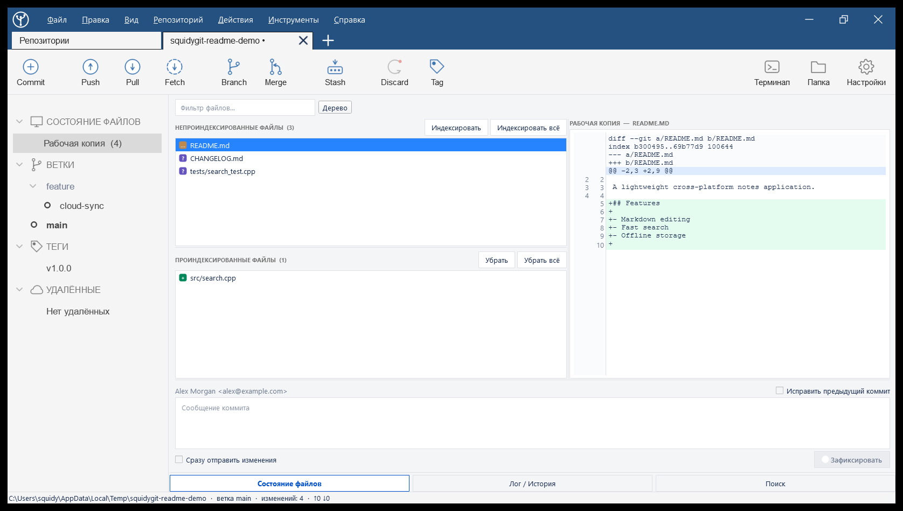
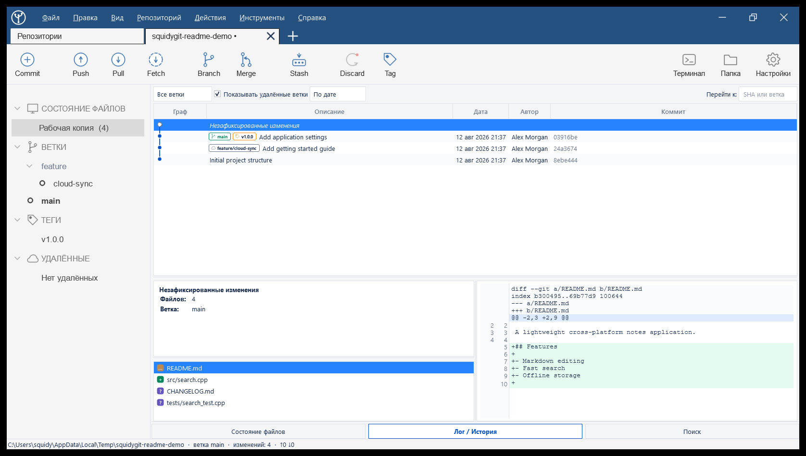
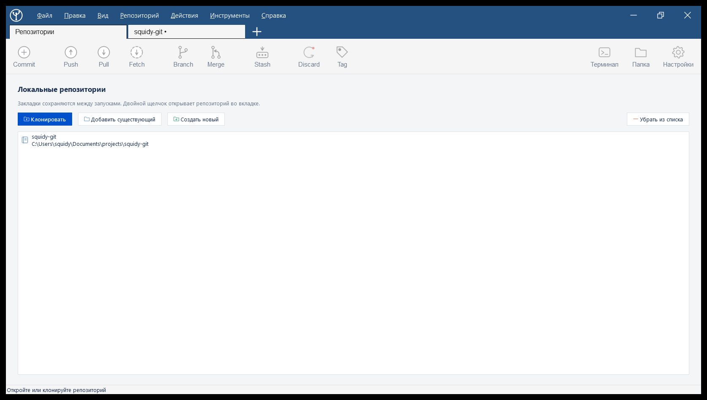

<!-- Copyright (c) 2026 Sergey Yakunin <sergey@squidy.ru> -->

# SquidyGit

<p align="center">
  
</p>

<p align="center">
  一款使用 C++20 和 Qt 6 构建的快速原生桌面 Git 客户端。
</p>

<p align="center">
  
</p>

<p align="center">
  <a href="README.md">English</a> · <a href="README.ru.md">Русский</a> · <a href="README.zh-CN.md">简体中文</a>
</p>

## 为什么选择 SquidyGit？

我一直找不到一款适合日常工作流程的 Linux Git 客户端。有些工具功能过于有限，
有些则显得过于复杂，还有许多工具无法在一个原生桌面应用中同时提供我所需要的
仓库历史、暂存和分支管理功能。因此，我决定自己构建一款。

SquidyGit 旨在让常用的 Git 操作清晰直观，同时不隐藏底层工具。它调用系统中的
`git` 可执行文件，并在命令日志中显示执行的每一条命令。

## 截图

### 仓库工作区

在同一个视图中查看已暂存和未暂存的文件、分支、标签以及实时差异。

<p align="center">
  
</p>

### 提交历史

历史视图整合了提交图、引用、变更文件和差异预览。

<p align="center">
  
</p>

### 仓库列表

打开现有仓库、克隆远程项目或初始化新仓库。

<p align="center">
  
</p>

## 功能

- 仓库标签页、书签和会话恢复
- 分别显示已暂存和未暂存文件的工作树视图
- 支持筛选和状态标记的平面及目录树文件视图
- 带有新旧行号和语法感知高亮的统一差异查看器
- 按区块或单行进行部分暂存和放弃更改
- 提交、修正提交以及提交后可选推送工作流
- 显示分支、标签和合并提交的可视化提交图
- 创建、切换、重命名和删除分支，以及合并和变基
- 支持上游分支、标签和 `--force-with-lease` 选项的获取、拉取和推送
- 管理储藏（stash）、标签、远程仓库和子模块
- 按提交信息、作者、文件内容、路径或 SHA 搜索提交
- 浅色和深色主题
- 内置所有已执行 Git 命令的日志

## 技术栈

SquidyGit 是一款使用 C++20 构建的原生应用，依赖：

- Qt 6：Core、Gui、Widgets 和 Concurrent
- CMake 3.16 或更高版本
- 系统 Git 命令行客户端

无需额外的运行时库或嵌入式 Git 实现。

## 构建

### Linux

安装支持 C++20 的编译器、CMake、Git 和 Qt 6 开发包，然后运行：

```bash
cmake -S . -B build -DCMAKE_BUILD_TYPE=Release
cmake --build build --parallel
./build/SquidyGit
```

为当前用户安装应用程序、桌面条目和图标：

```bash
cmake --install build --prefix ~/.local
```

为 Debian 或 Ubuntu 构建 DEB 软件包：

```bash
cmake -S . -B build -DCMAKE_BUILD_TYPE=Release
cmake --build build --target deb_package
```

即使当前 CLion 配置为 Debug，`deb_package` 目标也始终使用单独的 Release 构建。
在 CLion 中重新加载 CMake，在 CMake 工具窗口中选择 `deb_package` 并构建该目标。
生成的软件包将写入 `build/dist`。

### Windows

安装带有 MinGW 的 Qt 6，然后将 CMake 指向 Qt 安装目录：

```powershell
cmake -S . -B build -DCMAKE_PREFIX_PATH=C:/Qt/6.x.x/mingw_64
cmake --build build --parallel
.\build\SquidyGit.exe
```

Windows 构建会自动运行 `windeployqt`，并将所需的 Qt 运行时文件复制到可执行文件旁边。

要构建 Windows 安装程序，请安装 Inno Setup 6.3 或更高版本，然后运行：

```powershell
cmake --build build --target windows_installer
```

安装程序将生成在 `build/dist/SquidyGit-0.0.1-windows-x64.exe`。它会将 SquidyGit
安装到 `Program Files`，创建开始菜单和桌面快捷方式，并包含卸载程序。安装过程中
会请求管理员权限。较新的安装程序会就地升级已安装的版本，内置的更新检查正是基于
这一点。

## 安全性

放弃更改、硬重置和删除分支等潜在破坏性操作均需要确认。交互式凭据提示已禁用，
因此访问私有仓库需要使用 SSH 密钥或已配置的 Git 凭据助手。

## 许可证

SquidyGit 根据 [MIT 许可证](LICENSE)发布。

Copyright (c) 2026 Sergey Yakunin &lt;sergey@squidy.ru&gt;
